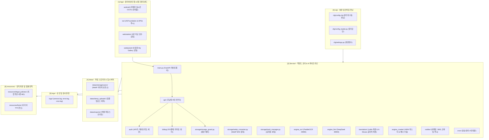

# 픽트로 (Pictro) 엔터프라이즈 소스 모듈 구성도

**작성일**: 2026-09-26 (v2.0 픽트로 엔터프라이즈 통합 플랫폼 반영)  
**작성자**: 20년 경력 시니어 개발자  
**설계 철학**: 단일 책임 원칙(SRP), 관심사 분리(SoC), 모듈당 200~300줄 이내 유지, 고도화 및 유지보수 용이성 극대화

---

## 1. 전체 디렉토리 및 모듈 레이아웃 구조

실제 작업 및 배포 디렉토리인 `Program/` 구조(`D:\Project\FoxUnni\Pictro\Program\` 및 리눅스 `/home/mika/Project/ThrillRig/Program/Pictro/`)를 기준으로 7대 핵심 디렉토리로 모듈화되어 있습니다:

```text
Program/ (픽트로 최상위 실행 및 개발 루트)
│
├── cfg/                                # [1] 설정 및 환경 변수 디렉토리
│   ├── config.cfg                      # [★] 관리자 수동 설정 INI (보관일수, 쿼터용량, 임계치 등 실시간 튜닝)
│   ├── config_loader.py                # config.cfg 파서 및 런타임 핫리로딩(Hot-Reload) 모듈
│   ├── settings.py                     # 환경변수(.env), 포트, DB URL, 보안 시크릿 키
│   └── constants.py                    # 시스템 불변 상수 정의
│
├── Service/                            # [2] 백엔드 코어 서비스 & AI 파이프라인 & API 라우터
│   ├── main.py                         # 서비스 엔트리포인트 (FastAPI 앱 마운트 및 라우터 등록, 60줄 내외)
│   ├── requirements.txt                # 파이썬 필수 의존성 목록
│   │
│   ├── core/                           # 인프라 공통 코어 모듈
│   │   ├── database.py                 # MySQL SQLAlchemy / PyMySQL 커넥션 풀
│   │   ├── redis_cache.py              # Redis 쿼터 및 최저가 랭킹 캐시 래퍼
│   │   ├── exceptions.py               # 커스텀 예외 정의 (QuotaExceeded, StorageFull)
│   │   └── logger.py                   # logs/ 디렉토리 연동 회전 로거
│   │
│   ├── auth/                           # 인증, 보안 및 권한 제어
│   │   ├── api_key_validator.py        # X-API-Key 검증 및 유효기간 확인
│   │   ├── rate_limiter.py             # 초당 호출 빈도(Rate Limit) 제어 (Redis 슬라이딩 윈도우)
│   │   └── session_manager.py          # 관리자 / 구독 회원 웹 로그인 JWT 세션
│   │
│   ├── storage/                        # 스토리지 최적화 및 용량 통제
│   │   ├── webp_converter.py           # 원본 이미지를 고효율 WebP로 무손실 압축 변환 (60% 절감)
│   │   ├── storage_guard.py            # 회원별 잔여 용량 체크 (1GB/10GB/100GB 초과 차단)
│   │   ├── file_manager.py             # datas/ 디렉토리 내 사용자별 폴더 생성, 저장, 경로 반환
│   │   └── trash_manager.py            # 휴지통 Soft Delete 및 30일 복구/영구삭제 제어
│   │
│   ├── engine_ocr/                     # OCR 인식 및 시각화 엔진
│   │   ├── paddle_client.py            # PaddleOCR(포트: 49990) 호출 클라이언트
│   │   ├── visualizer.py               # 바운딩 박스 오버레이 시각화 이미지 렌더러 (색상/두께)
│   │   └── image_preprocessor.py       # 1920px 초장문 배너 자동 리사이징/다운샘플링
│   │
│   ├── engine_llm/                     # LLM 비정형 텍스트 구조화 엔진
│   │   ├── deepseek_client.py          # DeepSeek LLM(포트: 39990) 통신 래퍼
│   │   ├── prompt_templates.py         # 시술명, 샷수, 가격, 부가세 추출 전용 프롬프트
│   │   └── synonym_normalizer.py       # 시술 표준어 매핑 (동의어 사전 캐시)
│   │
│   ├── engine_crawler/                 # 수집 크롤러 및 마스터 엔진
│   │   ├── hira_api_collector.py       # 심평원 공공데이터 전국 병의원 마스터 수집기
│   │   ├── banner_scraper.py           # 병원 웹사이트/이벤트 페이지 배너 수집기 (Playwright)
│   │   └── deduplicator.py             # 이미지 SHA256 해시 기반 중복 수집 방지
│   │
│   ├── billing/                        # 과금, 카드 결제 및 쿼터 미터링
│   │   ├── card_billing_pg.py          # PG사(토스/포트원) 카드 등록 및 빌링키 정기결제 연동
│   │   ├── usage_meter.py              # API 호출 카운트 및 DB 로깅 (`api_usage_log`)
│   │   ├── quota_manager.py            # 일일/월간 호출 쿼터 실시간 차감 및 조회
│   │   └── invoice_generator.py        # 월별 정산 및 신용카드 매출전표 영수증 생성
│   │
│   ├── translation/                    # AI 배경 복원(Inpainting) 및 다국어 이미지 치환 엔진
│   │   ├── lama_inpainter.py           # simple-lama-inpainting (big-lama 가중치 기반 배경 복원)
│   │   ├── color_extractor.py          # OpenCV K-Means 기반 글자색(HEX) 및 배경색/폰트크기 추출
│   │   ├── llm_translator.py           # 카리 서버 39990 포트 DeepSeek LLM 의료/시술 전문 번역 연동
│   │   ├── glossary_manager.py         # 분야별 교정 용어사전 DB(`translation_glossary_db`) 관리
│   │   └── text_renderer.py            # Pillow 기반 동일 좌표/동일 글자색 다국어 텍스트 합성 렌더러
│   │
│   ├── api/                            # RESTful API 엔드포인트 라우터 (FastAPI)
│   │   ├── v1_clinics.py               # GET /api/v1/clinics (병원 및 최저가 검색)
│   │   ├── v1_user_gallery.py          # GET, DELETE /api/v1/user/ocr-photos (내 사진 갤러리)
│   │   ├── v1_batch_upload.py          # POST /api/v1/user/batch-upload (최대 50장 일괄 업로드)
│   │   ├── v1_ocr_service.py           # POST /api/v1/ocr/recognize (외부 B2B 독립 제공용 초고속 OCR API)
│   │   ├── v1_translation.py           # POST /api/v1/translate-image (배경복원 & 다국어치환 API)
│   │   ├── v1_legal.py                 # GET /api/v1/legal/terms (약관조회), POST /agree (동의이력)
│   │   ├── v1_export.py                # GET /api/v1/user/export-excel (엑셀 일괄 다운로드)
│   │   ├── v1_payment.py               # POST /api/v1/billing/card (카드 등록, 구독결제, 영수증)
│   │   └── v1_admin.py                 # POST, PUT /api/v1/admin (3단 검수 승인, 키 발급)
│   │
│   ├── notifier/                       # 결제/유예/푸시 알림 발송 모듈 (이메일 & SMS & Push)
│   │   ├── email_sender.py             # SMTP / SES 기반 결제예정, 실패, 만료안내 이메일 발송
│   │   ├── sms_sender.py               # 솔라피/알리고 기반 카카오 알림톡 및 문자(LMS) 발송
│   │   └── push_sender.py              # Firebase (FCM) & Apple (APNs) 모바일 푸시 알림 발송
│   │
│   ├── cron/                           # 주기적 백그라운드 배치 데몬
│   │   ├── purge_trash_cron.py         # 휴지통 30일 경과 사진 영구 삭제 스케줄러
│   │   ├── purge_temp_cron.py          # 24시간 초과 임시 파일 자동 청소 스케줄러
│   │   ├── grace_period_cron.py        # 구독 만료 30일 유예기간 체크 및 알림/푸시 자동 발송
│   │   └── crawler_batch_cron.py       # 심평원 마스터 & 이벤트 배너 주기적 자동 수집
│   │
│   └── deploy/                         # 서버 배포 및 웹서버 설정
│       ├── nginx.conf                  # Nginx 리버스 프록시 및 WebP 정적 서빙/SSL 설정
│       ├── pictro.service              # Systemd 무중단 데몬 등록 스크립트 (Auto-Restart)
│       └── run.sh                      # Uvicorn 백그라운드 구동 쉘 스크립트
│
├── App/                                # [3] 클라이언트 어플리케이션 레이어 (모바일 & 웹)
│   ├── android/                        # Android Studio 네이티브 프로젝트 (카메라 OCR, 핀치줌, 푸시)
│   ├── ios/                            # Xcode 네이티브 프로젝트 (AVFoundation, APNs)
│   └── web/                            # 웹 프론트엔드 (운영진 검수 포털 & 사용자 My Gallery)
│
├── datas/                              # [4] 데이터 저장소 및 파일 스토리지
│   ├── storage/users/{client_id}/      # 사용자별 WebP 원본/시각화/치환 이미지 영구 보관소
│   ├── temp_uploads/                   # 대량 업로드 비동기 임시 버퍼 (24시간 보관 후 정리)
│   └── exports/                        # 엑셀/CSV 추출 임시 다운로드 파일
│
├── Doc/                                # [5] 솔루션 기술 문서, 설계 산출물 및 매뉴얼 디렉토리
│   └── (개발계획서, 소스 모듈 구성도, 상용 DB 스키마 DDL 등 보관)
│
├── logs/                               # [6] 시스템 운영 및 감사 회전 로그
│   ├── service.log                     # API 및 비즈니스 서비스 로그
│   ├── access.log                      # Nginx / Uvicorn HTTP 접근 로그
│   ├── error.log                       # 에러 추적 로그
│   ├── cron.log                        # 배치 청소 데몬 실행 로그
│   └── billing_audit.log               # 과금 및 감사 원장 기록 로그
│
└── resources/                          # [7] 정적 리소스, 폰트 및 독립 법률 정책 문서
    ├── logos/                          # 솔루션 공식 대표 심볼 로고 (시안 B 뷰파인더&스마트번역)
    │   ├── pictro_logo.svg      # 공식 무손실 벡터 마스터 (웹/앱 스케일러블)
    │   ├── pictro_symbol.svg    # 투명 배경 벡터 심볼
    │   ├── pictro_logo.png      # 공식 외곽 배경 투명화 고해상도 PNG (웹/앱 메인)
    │   ├── pictro_symbol.png    # 완전 투명 배경 라인 심볼 PNG (아이콘/파비콘용)
    │   ├── pictro_logo.jpg      # 공식 래스터 마스터 (300dpi)
    │   └── pictro_symbol.jpg    # 모바일 앱 아이콘 & 웹 파비콘 전용 심볼
    ├── legal_policies/                 # 상업용 서비스 이용약관 및 고객 동의 정책 마크다운
    │   ├── terms_of_service.md         # 상업용 서비스 이용약관 (라이선스, AI 번역 면책 조항)
    │   ├── privacy_policy.md           # 개인정보 처리방침 (담당자 연락처 수집 목적 및 파기)
    │   ├── auto_billing_consent.md     # 전자금융거래 및 카드 정기결제 동의 약관 (30일 유예 고지)
    │   ├── image_copyright_consent.md  # 업로드 사진 저작권/초상권 보증 및 AI 활용 동의
    │   └── marketing_push_consent.md   # 마케팅 알림 수신 동의 (선택)
    ├── fonts/                          # 다국어 치환 합성용 TTF 폰트 (한국어, 영어, 일본어, 중국어, 베트남어)
    └── templates/                      # 알림 이메일 및 정산 청구서 HTML 템플릿
```

---

## 2. 계층별 역할 및 상호 의존 관계 다이어그램



---

## 3. 모듈별 상세 책임(SRP) 및 코드 분할 가이드

### [★] `cfg/config.cfg` 관리자 전용 설정 파일 (코드 수정 없이 파라미터 튜닝)
운영자가 vi 또는 메모장으로 언제든지 즉시 변경 가능한 설정 파일입니다:
```ini
[STORAGE]
grace_period_days = 30         # 구독 미납/해지 시 사진 임시 보관 유예일수 (기본 30일)
trash_retention_days = 30      # 휴지통 보관일수 (기본 30일 후 영구삭제)
max_batch_upload_count = 50    # 1회 최대 드래그&드롭 업로드 허용 장수
max_image_width = 1920         # 배너 자동 리사이징 최대 가로폭 (px)

[QUOTA_STORAGE_MB]
starter_limit_mb = 1000        # 베이직 1단계 (1 GB)
business_limit_mb = 10000      # 프로 2단계 (10 GB)
enterprise_limit_mb = 100000   # 엔터프라이즈 3단계 (100 GB)

[OCR_ENGINE]
confidence_threshold = 0.85    # 자동 승인 신뢰도 임계치 (85% 미만은 수동 검수 큐로 이동)
default_box_color = #00f076    # OCR 검출 박스 기본 색상
default_line_width = 2         # 박스 선 두께

[SERVICES]
paddle_ocr_url = http://127.0.0.1:49990
deepseek_llm_url = http://127.0.0.1:39990
```

### ① `Service/main.py` (슬림한 최상위 진입점 - 목표: 60줄 이하)
* **역할** : 비즈니스 로직 일체 배제. `cfg/config_loader.py`를 통해 설정을 로드하고, CORS 설정, 라우터 포함(`include_router`), `datas/` 및 `resources/` 정적 디렉토리 마운트만 수행.

### ② `Service/storage/` (스토리지 엔진 분할)
* `webp_converter.py` : 업로드된 원본 이미지를 품질 저하 없이 WebP로 변환 (용량 60% 절감 단일 기능).
* `storage_guard.py` : 회원 ID의 현재 사용 용량(`current_storage_bytes`)과 플랜 한도(`max_storage_bytes`) 비교 검증.
* `file_manager.py` : `datas/storage/users/{client_id}/` 디렉토리 자동 생성 및 파일 저장/경로 관리.
* `trash_manager.py` : 사진 삭제 시 DB `is_deleted=1` 플래그 처리 및 30일 내 복구 기능 담당.

### ③ `Service/engine_ocr/` (OCR 및 시각화 분할)
* `paddle_client.py` : 49990 포트 HTTP 통신 및 재시도(Retry) 전담.
* `visualizer.py` : OpenCV/PIL 기반 바운딩 박스 렌더링 전담 (선 두께, 색상, 신뢰도 라벨 오버레이).
* `image_preprocessor.py` : 1920px 초과 긴 배너를 OCR 최적 크기로 자동 리사이징.

### ④ `Service/translation/` (배경 복원 및 다국어 치환 분할)
* `lama_inpainter.py` : simple-lama-inpainting 기반 글자 영역 지우기 및 자연스러운 배경 복원.
* `color_extractor.py` : OpenCV K-Means 기반 글자색(HEX) 및 배경색/폰트크기 정밀 추출.
* `llm_translator.py` : 카리 39990 DeepSeek LLM 의료/뷰티 전문 다국어 1:1 번역.
* `glossary_manager.py` : DB 용어사전 동기화 및 번역 자가학습 프롬프트 주입.
* `text_renderer.py` : `resources/fonts/` 폰트를 사용한 동일 좌표 다국어 텍스트 합성.

### ⑤ `Service/api/` (라우터 파일 쪼개기 - 각 파일 150줄 내외)
* `v1_ocr_service.py` : B2B 유료 호출 전용 엔드포인트 (`/ocr/visualize`).
* `v1_batch_upload.py` : 최대 50장 드래그&드롭 비동기 일괄 업로드 처리 (`datas/temp_uploads/`).
* `v1_user_gallery.py` : 사용자별 사진 리스트 조회, 폴더 분류, 썸네일 반환.
* `v1_translation.py` : 배경복원 및 다국어 이미지 치환 API.
* `v1_export.py` : pandas/openpyxl을 이용한 엑셀 파일 스트리밍 다운로드 (`datas/exports/`).
* `v1_admin.py` : 내부 검수용 승인/반려 및 키 관리.

### ⑥ `App/` (클라이언트 모바일 & 웹 UI 분할)
* `android/` : 카메라 실시간 바운딩 촬영, 핀치줌 뷰어, FCM 푸시 수신 네이티브 앱.
* `ios/` : AVFoundation 카메라 촬영, UIScrollView 핀치줌, APNs 푸시 네이티브 앱.
* `web/admin/` & `web/portal/` : 운영진 3단 비교 검수 포털 및 구독 고객 My Gallery 웹 UI.

### ⑦ `Service/cron/` (스케줄러 모듈 분할)
* 각각 독립적인 파이썬 스크립트로 동작하여 리눅스 crontab 또는 Celery Beat에서 개별 실행 가능.
* 실행 결과와 오류는 `logs/cron.log` 및 `logs/billing_audit.log`에 회전 로깅.

---

## 4. 기대 효과
1. **코드 비대화(Bloated Code) 원천 차단** : 단일 파일이 수천 줄로 커지는 현상 완전 방지.
2. **장애 격리** : OCR 모듈에 문제가 생겨도 크롤러나 갤러리 조회 API는 정상 작동.
3. **손쉬운 단위 테스트** : 각 모듈(WebP 변환기, 박스 시각화기, 쿼터 체커 등)을 독립적으로 테스트 가능.
