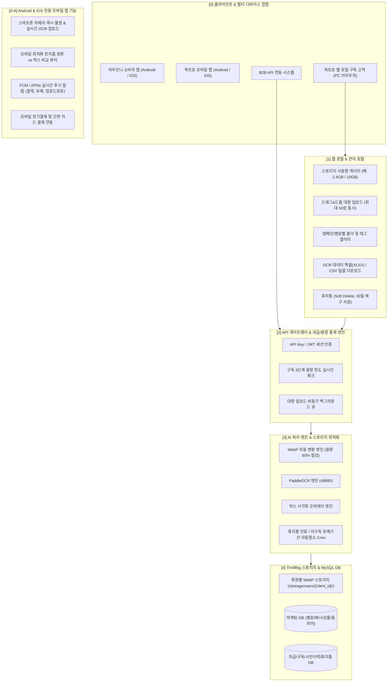
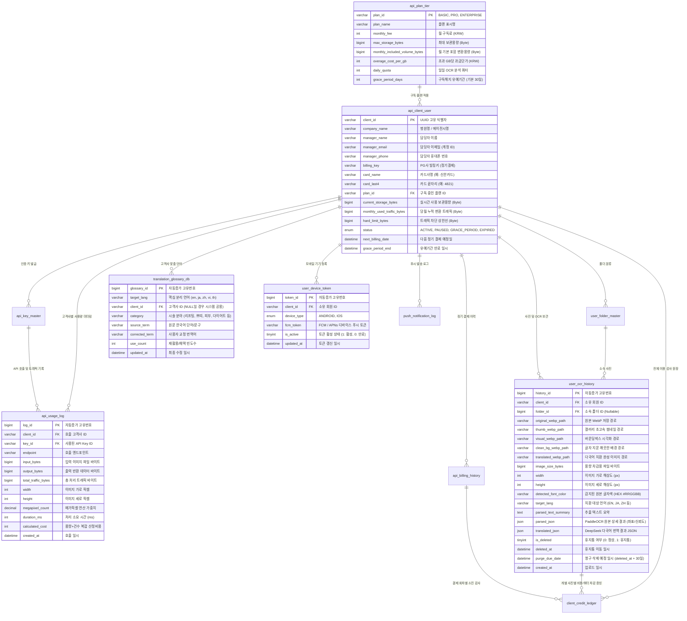

# 픽트로 (Pictro) - AI 멀티모달 비전·OCR·배경복원·다국어치환 통합 플랫폼 개발 계획서

**작성일**: 2026-09-26 (v2.0 픽트로 엔터프라이즈 통합 플랫폼 고도화)  
**작성자**: 20년 경력 시니어 개발자  
**연관 시스템**: `ThrillRig MySQL (3306)`, `PaddleOCR Service (49990)`, `DeepSeek LLM (39990)`, `LaMa Inpainting`, `Service API Gateway`, `User Web Portal`, `Admin Portal`, `Mobile Native Apps`  
* **엔진 test url** : `http://thrillrig.com:9990/pictro/` (실시간 픽트로 스튜디오 웹 콘솔)  
* **REST API test url** : `http://thrillrig.com:9990/pictro-api/docs` (Swagger UI 대화형 테스트)  

---

## 1. 서비스 개요 및 상용화 비전
**픽트로(Pictro)**은 단순 마케팅 수집을 넘어선 **AI 멀티모달 비전·OCR·배경복원(Inpainting)·글자색추출 치환·전문 다국어 번역·B2B 스토리지 과금 통합 엔터프라이즈 플랫폼**입니다.  
전국 병의원 광고 배너와 이벤트 전단지, 팜플렛 속 시술 정보(시술명, 샷수, 용량, 정가, 할인가, 조건)를 **PaddleOCR(49990)**과 **DeepSeek LLM(39990)**으로 초정밀 자동 추출하고, **LaMa Inpainting**으로 글자를 지워 깨끗한 배경을 복원하며, 원본 글자색(HEX)을 감지하여 동일한 색상/스타일의 다국어(영/일/중/베트남)로 1:1 치환 합성합니다.  
또한 사용자가 직접 교정한 단어를 언어별로 축적하여 자가 학습하는 **Glossary DB**, 3단계 스토리지 과금, 복식부기 감사 원장(`client_credit_ledger`), 모바일 푸시 알림 및 네이티브 앱(Android/iOS)을 아우르는 글로벌 상용 플랫폼입니다.

---

## 2. 전체 시스템 아키텍처 (상용 SaaS 풀스택 구조)



---

## 3. 구독 플랜 3단계 및 스토리지 용량 정책

사용자가 웹 사이트에 로그인하여 본인이 OCR 처리한 사진(원본 + 시각화 박스 이미지 + 추출 텍스트)을 보관하고 열람할 수 있도록 **3단계 구독 모델**을 적용합니다.

### 3.1 구독 등급별 혜택 및 저장 용량 (WebP 60% 압축 적용 기준)
| 구독 등급 | 월 구독료 (예시) | **기본 제공 저장 용량** | 실제 저장 가능 장수 (WebP 적용) | 구독 유지 시 | **구독 만료/미납 시 유예 기간** |
| :---: | :---: | :---: | :---: | :---: | :---: |
| **1단계: 베이직 (Starter)** | 월 19,000원 | **1 GB** | **약 4,500 장** (기존 1,500장의 3배) | **무기한 영구 보관** | **만료 후 30일간 임시 보관** (이후 자동 삭제) |
| **2단계: 프로 (Business)** | 월 59,000원 | **10 GB** | **약 45,000 장** (기존 15,000장의 3배) | **무기한 영구 보관** | **만료 후 30일간 임시 보관** (이후 자동 삭제) |
| **3단계: 엔터프라이즈 (Pro)** | 월 190,000원 | **100 GB** | **약 450,000 장** (대형 에이전시용) | **무기한 영구 보관** | **만료 후 60일간 임시 보관** (이후 자동 삭제) |

### 3.2 구독 해지/미납 시 유예 기간(Grace Period) & 재구독 유도 정책
* **구독 유지 상태** : 용량 한도(1GB / 10GB / 100GB) 내에서는 날짜 제한 없이 **무기한 영구 보관**.
* **구독 만료/미납/해지 시** :
  1. 즉시 사진을 삭제하지 않고 **30일간의 '보호 유예 기간(Grace Period)'** 부여.
  2. 사이트 접속 시 "30일 내에 재구독하시면 소중한 사진 데이터가 복구/유지됩니다" 경고 모달 및 알림톡 발송으로 **재구독(리텐션) 강력 유도**.
  3. 유예 기간(30일) 종료 시까지 재구독이 없을 경우, 서버 스토리지 및 DB에서 영구 삭제(Purge)하여 디스크 공간 회수.

### 3.3 기업형 B2B API 변환 용량(Volume & Resolution) 종량 과금 정책
단순 호출 건수(Request Count) 과금에 더해, 고해상도·대용량 이미지 처리에 따른 GPU 연산 부하 및 네트워크 대역폭(트래픽)을 완벽히 방어하기 위해 **"변환 데이터 용량 및 해상도(픽셀) 복합 미터링 과금 체계"**를 적용합니다.

1. **미터링 3대 핵심 지표 (I/O Traffic + Compute)** :
   * **입력 데이터 용량 (Input Payload Bytes)** : 고객사가 API로 전송한 원본 이미지 파일 크기 실측
   * **출력 데이터 용량 (Output Traffic Bytes)** : OCR 시각화, 글자 제거 배경, 번역 합성 WebP 등 반환된 총 데이터 전송량
   * **연산 가중치 (Megapixel Tiering)** : 이미지 해상도(`Width x Height`)에 따른 GPU VRAM 점유 및 인페인팅 연산량 가중치 계수 적용
2. **기업형 요금 모델 (Hybrid Metering)** :
   * **기본 포함 용량 (Included Volume)** : 각 플랜별 월간 기본 변환 트래픽 제공 (예: Starter 50GB, Business 300GB, Enterprise 1TB)
   * **초과 용량 종량 과금 (Overage Billing)** : 기본 제공 용량 소진 시 1GB 초과당 종량 단가(예: GB당 50~100원) 자동 산정
   * **해상도별 할증 티어 (Resolution Multiplier)** :
     * Standard (FHD 이하, ~200만 화소) : 기본 요율 (1.0x)
     * High-Res (4K급, 200만~850만 화소) : 연산 가중치 (1.5x)
     * Ultra-Res (대형 배너, 850만 화소 초과) : 연산 가중치 (2.5x)
3. **실시간 쿼터 검증 (Pre-Flight Guard)** :
   * API 진입 시 `Content-Length` 및 잔여 월간 용량 쿼터를 사전 검증하여 기업 예산 초과(Hard Limit) 및 디도스(DoS)형 비정상 대용량 페이로드 사전 차단(429/402 반환).

---

## 4. 선도 플랫폼 벤치마킹 5대 고도화 기능

### 4.1 저장 용량 60% 절약 : WebP 자동 변환 엔진
* 업로드된 모든 이미지(JPG, PNG)는 즉시 고효율 **WebP 포맷으로 자동 변환**하여 저장.
* **효과** : 고객에게는 **"동일 요금에 3배 더 많은 사진 저장"** 혜택 제공, 서비스 운영 측면에서는 **서버 디스크 비용 및 네트워크 트래픽 60% 절감**.

### 4.2 대량 일괄 업로드 (Batch Multi-Upload) & 비동기 큐
* 드래그 & 드롭으로 한 번에 **최대 50장 동시 업로드** 지원.
* 서버 백그라운드 큐에서 순차적으로 OCR 및 시각화 처리를 수행하며 실시간 진행률(Progress Bar, 예: 24/50 완료) 제공.

### 4.3 캠페인 폴더링 및 태그 분류
* 갤러리 내에 **폴더 생성** 기능 제공 (예: `2026 가을 리프팅 이벤트`, `강남본점 프로모션`).
* 시술 부위/종류별 태그 자동 부여 (`#보톡스`, `#슈링크`, `#필러`).

### 4.4 휴지통 (Soft Delete) 및 30일 복구 안전장치
* 사용자가 사진을 삭제할 경우 즉시 디스크에서 삭제하지 않고 **[휴지통]**으로 이동.
* 실수로 지운 사진은 **30일 이내에 원클릭 복구** 가능.
* 30일 경과 시 자정 배치 Cron이 영구 삭제 처리하여 디스크 회수.

### 4.5 분석 결과 엑셀(XLSX) / CSV 일괄 다운로드
* 갤러리에서 원하는 사진들을 다중 선택 후 **[엑셀로 내보내기]** 클릭 시, 시술명, 용량/샷수, 정가, 할인가, 부가세 여부가 정리된 엑셀 파일 즉시 생성 다운로드.

### 4.6 신용/체크카드 자동 정기결제 UI 및 카드 관리
* **신용카드 결제 모달 (플랜 구독창)** :
  * 3단계 플랜 선택 시 토스페이먼츠/포트원 표준 **카드 간편결제 팝업** 연동.
  * 카드번호, 유효기간, 생년월일 입력 시 안전한 **빌링키(Billing Key)** 발급 및 최초 결제 진행.
  * 결제 완료 즉시 사용자 스토리지 용량이 **1GB → 10GB → 100GB로 실시간 확장**.
* **마이페이지 [결제 관리 및 이용 명세서] 탭** :
  * 등록된 결제 카드 정보 확인 (`신한카드 (끝자리 4821)`) 및 [결제 카드 변경] 기능.
  * 매월 정기결제일(예: 매월 26일) 및 결제 예정 금액 표기.
  * 월별 **신용카드 매출전표(영수증) 열람 및 인쇄/다운로드**.
  * **[결제 분쟁 방지] 월별 상세 이용 정산 명세서 (Detailed Usage Statement & Audit Report)** :
    * 고객사가 "언제 결제했고, 결제한 돈/쿼터를 어떻게 썼는지" 따질 때 100% 입증 가능한 증빙 자료 제공.
    * **명세서 포함 항목** : 결제 승인 일시, 구독 기간(예: 9/1~9/30), 결제 금액, 소비된 총 OCR 분석 건수, 다국어 치환 건수, 최대 피크 저장 용량.
    * **상세 감사 원장 (Audit Log) 엑셀/PDF 다운로드** :
      * 어떤 직원이(IP/단말기), 언제(마이크로초 타임스탬프), 어떤 배너 사진(`user_ocr_history` 1:1 매칭 링크)을 업로드하여 쿼터나 비용이 차감되었는지 1건 단위로 100% 투명하게 입증.
  * 구독 해지(유예 기간 30일 안내 포함) 및 플랜 즉시 업그레이드 지원.


### 4.7 담당자 연락처(이메일·문자) 수집 및 결제·유예 자동 알림 시스템
* **필수 입력 정보 수집** :
  * 회원가입 및 프로필 설정 시 **회사명, 담당자 이름, 담당자 이메일, 담당자 휴대폰 번호**를 필수로 입력받음.
* **자동 알림 발송 시나리오 (이메일 + 카카오 알림톡/문자 SMS)** :
  1. **정기 결제 D-3일 전** : "3일 후 정기결제 예정 안내" (결제 예정 금액 및 카드 뒷자리)
  2. **결제 실패/카드 만료 당일** : "결제 실패 안내 및 결제 카드 변경 요청" (사진 보관 30일 유예기간 시작 안내)
  3. **유예 기간 D-7일 전 (긴급)** : "소중한 사진 데이터 영구 삭제 7일 전 안내" (재구독 시 즉시 복구 및 유지 링크 전송)
  4. **스토리지 90% 도달 시** : "저장 공간 90% 도달 안내" (상위 플랜 업그레이드 링크)

### 4.8 Android & iPhone (iOS) 전용 모바일 앱 서비스
* **모바일 전용 핵심 기능** :
  1. **스마트폰 카메라 즉시 촬영 OCR** : 현장 배너, 전단지, 팜플렛을 카메라로 촬영하면 즉시 서버로 전송되어 실시간 OCR 및 가격 분석.
  2. **모바일 최적화 핀치줌 갤러리** : 터치 제스처로 썸네일 그리드 탐색, 두 손가락 핀치 줌으로 원본 vs 박스 시각화 1:1 비교 확대/축소.
  3. **실시간 모바일 푸시 알림 (FCM / APNs)** : 결제일 도래, 결제 실패, 유예기간 D-7, 대량 업로드 완료 알림을 스마트폰 푸시 메시지로 수신.
  4. **모바일 간편 카드 결제** : 앱 내에서 신용카드 등록 및 정기 구독 원클릭 결제 지원.
* **IDE 전용 네이티브 프로젝트 구성** :
  * **Android Studio 프로젝트 (`/mobile/android_studio/`)** :
    * Gradle 빌드 스크립트(`build.gradle.kts`), `AndroidManifest.xml`, Kotlin 기반 액티비티/프래그먼트 구조
    * Android Studio에서 바로 **[Open Project]**로 열어 에뮬레이터 디버깅 및 Google Play용 APK/AAB 빌드
  * **Xcode 프로젝트 (`/mobile/xcode_ios/`)** :
    * Xcode 워크스페이스(`FoxUnniOCR.xcworkspace` / `FoxUnniOCR.xcodeproj`), `Info.plist`, Swift 기반 UI 뷰 구조
    * Mac 환경의 Xcode에서 바로 열어 iOS 시뮬레이터 테스트 및 TestFlight/App Store 아카이브 빌드

### 4.9 AI 배경 복원(Inpainting) 및 원본 글자색 유지 다국어 치환 엔진 (신규)
* **1) 원본 글자색 정밀 감지 및 스타일 추출 (Color & Style Detection)** :
  * **K-Means (K=2) 색상 클러스터링** : PaddleOCR이 반환한 텍스트 바운딩 박스 내부 픽셀을 분석하여, 외곽 배경색과 중심부 글자색을 완벽히 분리 추출.
  * **색상 코드 산출** : 글자의 메인 색상(RGB 및 `#FF3366` 같은 HEX 코드)을 0.001초 만에 자동 계산.
  * **폰트 크기 및 획 두께(Stroke) 추정** : 원본 텍스트 박스의 높이와 종횡비를 기반으로 최적의 폰트 크기 및 볼드(Bold), 외곽선 여부 자동 산출.
* **2) 배경 복원 엔진 (simple-lama-inpainting)** :
  * 원작 `big-lama` 정밀 가중치를 100% 동일하게 탑재하여 글자를 흔적 없이 지우고 원래의 사진/배경/그라데이션을 0.1초 내외로 완벽 복원.
* **3) 동일 글자색 1:1 다국어 치환 렌더링 (Matching-Color Replacement)** :
  * DeepSeek LLM이 의료/시술 전문 용어로 번역한 다국어 텍스트(영/일/중/베트남)를,
  * 깨끗하게 복원된 배경의 원본 좌표에 **[1번에서 알아낸 원본 글자색(HEX)과 동일한 색상 및 두께]**로 1:1 렌더링 합성.
  * 원본 배너의 그래픽 디자인 감각과 일체감을 100% 유지하면서 언어만 감쪽같이 치환됨.
* **4) 앱(App) & 웹(Web) UI 옵션 토글** :
  * 사용자가 업로드 시 또는 상세 뷰어에서 원클릭으로 선택 가능:
    * `[✔] 글자 지우기 (깨끗한 원본 배경만 생성)`
    * `[✔] 다국어 자동 치환 : [ 영어(EN) ▾ / 일본어(JA) ▾ / 중국어(ZH) ▾ / 베트남어(VI) ▾ ]`
    * `[✔] 원본 글자 색상(TextColor) 추출 및 동일 색상 치환 렌더링 적용`
* **5) 서비스 API URL 및 요청 옵션 파라미터** :
  * **엔드포인트** : `POST /api/v1/translate-image` 및 `POST /ocr/visualize`
  * **옵션 파라미터 (Query / Multipart Form)** :
    * `clean_bg` (Boolean, 기본값 `false`) : `true` 설정 시 글자가 지워진 배경 이미지만 반환.
    * `target_lang` (String, 기본값 `NONE`) : 치환 대상 언어 (`en`, `ja`, `zh`, `vi`, `th`).
    * `match_font_color` (Boolean, 기본값 `true`) : 원본 글자색을 자동 감출하여 동일 색상으로 치환 렌더링할지 여부.
  * **반환 결과** :
    * 원본 분석 JSON + 감지된 글자색 코드(`font_color: "#FF3366"`) + 번역 JSON + `translated_webp_path` (동일 글자색 치환 완성 이미지) + `clean_bg_webp_path` (글자 지운 배경 이미지).

### 4.10 사용자 번역 교정 UI 및 언어별·분야별 번역 용어사전(Glossary) DB 구축 (신규)
* **1) 사용자 실시간 번역 교정 UI (웹 포털 & 모바일 앱)** :
  * 자동 번역된 문구가 어색할 경우, 상세 뷰어에서 텍스트 박스를 직접 클릭하여 즉시 수정:
    * `원문` : `슈링크 유니버스 300샷 9.9만`
    * `AI 자동 번역` : `Shrink Universe 300 Shots $99`
    * `사용자 직접 수정` : `Shurink Universe 300 Shots 99,000 KRW`
  * **[수정 즉시 반영]** 버튼 클릭 시, 수정된 단어로 배너에 0.1초 만에 재렌더링 합성.
* **2) 언어별(Language-Specific) 독립 번역 용어사전 DB 구축 (`translation_glossary_db`)** :
  * 국가/언어별 특화 번역(영어, 일본어, 중국어 간체/번체, 베트남어 등)이 서로 충돌하지 않도록 **언어 코드(`target_lang`) 단위로 엄격히 데이터 분리 및 복합 인덱싱**.
  * **언어별 독립 구조** :
    * `target_lang` (`en` 영어, `ja` 일본어, `zh` 중국어, `vi` 베트남어, `th` 태국어)
    * `category` (시술 분야: 리프팅, 쁘띠/보톡스, 스킨부스터, 레이저제모, 비만체형 등)
    * `source_term` (원문 한국어 단어, 예: 슈링크)
    * `corrected_term` (해당 국가 언어에 맞춘 사용자 교정 번역어, 예: 일본어 `シュリンク`, 영어 `Shurink Universe`)
    * **고유 키 (Unique Key)** : `(client_id, target_lang, category, source_term)` 복합 유니크 인덱스로 언어별 초고속 0.1ms 매칭 보장.
* **3) 언어별 번역 엔진 자가 학습(Auto-Feedback) 및 최우선 주입** :
  * 영어로 번역할 때는 `target_lang = 'en'` 사전만, 일본어로 번역할 때는 `target_lang = 'ja'` 사전만 자동 로드하여 DeepSeek LLM 프롬프트에 주입.
  * **결과** : 언어 간 번역 간섭이나 왜곡이 원천 차단되며, 국가별/언어별 고유한 시술 외래어 표기법이 100% 보존됨.

### 4.11 상업용 서비스 이용약관 및 고객 법적 동의 관리 체계 (독립 파일 분리 관리) (신규)
상업적 서비스 운영 시 법적 분쟁을 방지하고 Google Play / Apple App Store 심사 규정을 100% 충족하기 위해, 모든 약관 문서를 **코드와 분리된 독립 마크다운 파일(`legal_policies/`)로 체계화**하고 동의 이력을 DB에 보존합니다:

* **1) 파일 기반 독립 약관 관리 (`legal_policies/` 디렉토리)** :
  * 앱/웹 소스에 하드코딩하지 않고 마크다운(`.md`) 파일로 분리하여, **법무 검토나 약관 개정 시 앱 재빌드 없이 서버 파일 수정만으로 즉시 반영**:
    1. `terms_of_service.md` : **상업용 서비스 이용약관** (B2B 구독 라이선스 범위, AI 번역 결과물 면책 조항, 데이터 소유권)
    2. `privacy_policy.md` : **개인정보 처리방침** (담당자 성명, 이메일, 휴대폰, 접속 IP 수집 목적 및 파기 기준)
    3. `auto_billing_consent.md` : **전자금융거래 및 카드 정기결제 동의 약관** (매월 자동결제 승인, 결제 실패 시 30일 유예 후 영구삭제 고지, 환불 규정)
    4. `image_copyright_consent.md` : **업로드 사진 저작권 보증 및 AI 활용 동의** (업로드한 배너의 초상권/상표권 책임은 고객사에 있음을 명시)
    5. `marketing_push_consent.md` : **마케팅 알림 수신 동의 (선택)** (이메일/SMS/FCM 알림 수신 여부)
* **2) 앱 및 웹 실시간 동적 렌더링 API** :
  * `GET /api/v1/legal/terms?type={tos|privacy|billing|image}&version=latest`
  * 모바일 앱 및 웹 결제/가입 화면에서 해당 엔드포인트를 호출하여 최신 버전의 약관 본문을 즉시 팝업/모달로 렌더링.
* **3) 고객 동의 내역 법적 감사 증빙 DB (`user_terms_agreement`)** :
  * 고객이 가입/결제 시 체크한 동의 내역을 **[동의 일시(타임스탬프), 동의한 약관 버전, 요청 IP, 디바이스]**와 함께 기록하여 향후 법적 분쟁 시 100% 면책 입증 자료로 활용.

### 4.12 독립 B2B OCR 외부 제공 API 및 단독 과금 체계 (신규)
픽트로는 전체 이미지 번역/치환 풀코스 파이프라인뿐만 아니라, **외부 개발사/기업 고객을 위한 고성능 OCR 단독 REST API 서비스**를 완벽히 분리·제공하여 B2B 수익 모델을 다각화합니다:

* **1) 독립 엔드포인트 개설 (`POST /api/v1/ocr/recognize`)** :
  * 입력: 이미지 바이너리 또는 접근 가능한 이미지 URL
  * 출력: 순수 텍스트, 바운딩 박스 정밀 좌표(`[ymin, xmin, ymax, xmax]`), 회전 각도, 인식 신뢰도(Confidence) JSON 응답 (평균 응답속도 0.1~0.2초 이내 초고속 반환)
  * 옵션 파라미터(`visualize=true`): 검수용 바운딩 박스 오버레이 시각화 이미지 URL/Base64 동시 제공
* **2) 단독 과금 플랜 및 API 미터링 연동** :
  * 풀코스(치환/번역) 구독과 별개로 **"OCR 단독 요금제(호출 건당 과금 또는 월 정액 쿼터 패키지)"** 분리 운영
  * `X-API-Key` 기반 호출 인증 및 Redis 슬라이딩 윈도우 초당 요청 수(Rate Limit) 제어
* **3) 디커플링(Decoupled) 아키텍처** :
  * `engine_ocr/` 모듈이 배경 복원(`translation/`)이나 번역(`engine_llm/`) 엔진에 종속되지 않고 독립 실행 가능하도록 설계
* **4) 변환 데이터 용량 및 대역폭 실시간 미터링 (`api_usage_log`)** :
  * API 호출 시 입력 이미지 크기(Input Bytes), 출력 데이터 크기(Output Bytes), 해상도(Pixel Count)를 마이크로초 단위로 기록
  * 기업 고객의 월간 변환 허용 용량(Included Traffic) 초과 시 자동 종량 과금 산정 및 실시간 쿼터 소진율 대시보드 제공

### 4.13 B2B 결제 수납(PG 빌링키·세금계산서) 및 분쟁 방지 감사 원장 관리 체계 (외부 연동 작업 예정)
고객과의 결제 마찰(미납, 결제 실패, 환불 분쟁)을 최소화하고 매달 안정적으로 현금을 회수하기 위한 글로벌 B2B 표준 하이브리드 수납 체계입니다:

* **1) 2-Track 결제 수납 모델 (PG 정기결제 + 가상계좌 선납)** :
  * **Track A (일반/개인/소호 병원)**: 토스페이먼츠(Toss Payments) 정기결제(빌링키) 연동.
    - 최초 1회 카드 등록 후 매월 지정일 자동 승인 (Starter 1.9만 / Pro 5.9만 / Enterprise 19.9만).
    - 기본 플랜 용량(1GB/10GB/100GB) 초과 시 월말 초과분(GB당 종량 과금) 후불 합산 청구.
  * **Track B (대형 법인/에이전시)**: 가상계좌 3개월/1년 선납(10% 할인 프로모션) 및 전자세금계산서(홈택스 연동) 자동 발급.
* **2) 분쟁 100% 방지 복식부기 감사 원장 (`client_credit_ledger`) 운영** :
  * B2B 기업 고객의 "언제 어디에 용량/비용을 썼는가?"에 대한 법적 방어 증빙.
  * 배너 1장 업로드/변환 시마다 [일시(ms), 요청자 IP, 배너 파일명, 처리 모드(detect/clear/trans), 차감 용량/금액, 차감 후 잔여량] 1:1 트랜잭션 기록.
  * 마이페이지에서 **"월별 이용 상세 정산 명세서 (PDF/Excel)"** 원클릭 다운로드 제공.
* **3) 스마트 더닝(Smart Dunning) & 30일 데이터 보호 유예 (Grace Period)** :
  * 카드 한도초과/유효기간 만료 결제 실패 시 즉시 삭제 방지.
  * 3일/7일 간격 자동 재승인 시도(최대 3회) 및 알림톡/이메일 안내.
  * 30일 동안 기존 배너 및 번역 데이터 완벽 보호(Soft Lock) 후, 30일 경과 시에만 영구 삭제(Purge).
* **4) 관리자(Admin) 전용 수납 관제 화면** :
  * MRR(월간 반복 매출), 결제 실패/연체자 리스트(클릭 한 번으로 카드 갱신 알림톡 발송), 용량 90% 임박 고객 리스트(상위 플랜 업셀링 타겟), PG사 실입금액 대사.


---

## 5. DB 스키마 상세 설계 (엔터프라이즈 고도화)

### 5.0 DB Server 구축 규격 (MySQL / MariaDB)
* **서버 DB 접속 IP/포트** : `thrillrig.com` (Port: `3306`)
* **Database 명** : `Pictro` (utf8mb4_unicode_ci)
* **DDL 스크립트 파일** : `Pictro\Program\Database\pictro.ddl`
* **DB 서비스 계정** : ID: `pictro` / PW: `pictro!@#$`
* **Local PC Workbench 및 원격 접속** : ID: `pictro` / PW: `pictro!@#$` (호스트: `%`, `localhost` 전체 허용)

본 시스템은 **MySQL 8.4 LTS (`Pictro` DB)** 환경에 최적화되어 있으며, B2B 대용량 사진 처리, 3단계 스토리지 과금, 모바일 푸시 알림, 언어별 AI 용어사전의 고속 처리를 보장하도록 설계되었습니다.

### 5.1 논리 ERD 관계 다이어그램



---

### 5.2 테이블별 상세 물리 컬럼 명세

#### 1) `api_plan_tier` (3단계 구독 과금 및 스토리지 티어)
| 컬럼명 | 데이터 타입 | 제약 조건 | 기본값 | 설명 |
| :--- | :--- | :--- | :--- | :--- |
| `plan_id` | VARCHAR(32) | PRIMARY KEY | - | 플랜 고유 코드 (`BASIC`, `PRO`, `ENTERPRISE`) |
| `plan_name` | VARCHAR(64) | NOT NULL | - | 화면 표시명 (예: "Basic (10GB) - 소형 의원") |
| `monthly_fee` | INT UNSIGNED | NOT NULL | 0 | 월 정기 구독료 (KRW, 예: 99,000 / 299,000) |
| `max_storage_bytes` | BIGINT UNSIGNED | NOT NULL | 10737418240 | 최대 저장 보관용량 바이트 (10GB / 50GB / 100GB) |
| `monthly_included_volume_bytes` | BIGINT UNSIGNED | NOT NULL | 53687091200 | **월 기본 포함 변환 용량 (50GB / 300GB / 1TB)** |
| `overage_cost_per_gb` | INT UNSIGNED | NOT NULL | 100 | **기본 변환용량 소진 시 초과 1GB당 단가 (KRW)** |
| `max_single_payload_bytes` | BIGINT UNSIGNED | NOT NULL | 52428800 | 단건 최대 허용 이미지 크기 (기본 50MB) |
| `daily_quota` | INT UNSIGNED | NOT NULL | 500 | 하루 최대 OCR/치환 API 호출 제한 수 |
| `grace_period_days` | SMALLINT UNSIGNED | NOT NULL | 30 | 결제 실패/구독 해지 시 데이터 보관 유예일수 (30일) |
| `created_at` | DATETIME | NOT NULL | CURRENT_TIMESTAMP | 등록 일시 |

#### 2) `api_client_user` (구독 고객사, 연락처 및 실시간 용량 모니터링)
| 컬럼명 | 데이터 타입 | 제약 조건 | 기본값 | 설명 |
| :--- | :--- | :--- | :--- | :--- |
| `client_id` | VARCHAR(64) | PRIMARY KEY | - | 클라이언트 고유 식별자 (UUID v4) |
| `company_name` | VARCHAR(128) | NOT NULL | - | 병원명 또는 마케팅 에이전시 회사명 |
| `manager_name` | VARCHAR(64) | NOT NULL | - | 알림 수신용 담당자 성명 |
| `manager_email` | VARCHAR(128) | UNIQUE, NOT NULL | - | 담당자 이메일 (로그인 ID 및 세금계산서/알림 수신) |
| `manager_phone` | VARCHAR(32) | NOT NULL | - | 담당자 휴대폰 번호 (결제실패/유예기간 카카오 알림톡 수신) |
| `plan_id` | VARCHAR(32) | FK (`api_plan_tier`) | 'BASIC' | 현재 구독 중인 플랜 |
| `billing_key` | VARCHAR(255) | NULL | NULL | PG사(토스/포트원) 카드 등록 빌링키 (암호화) |
| `card_name` | VARCHAR(32) | NULL | NULL | 등록 카드사명 (예: "신한카드", "현대카드") |
| `card_last4` | CHAR(4) | NULL | NULL | 카드 번호 끝 4자리 (예: "4821") |
| `current_storage_bytes` | BIGINT UNSIGNED | NOT NULL | 0 | **실시간 누적 보관 용량 (Byte, 사진 추가/삭제 시 자동 가감)** |
| `monthly_used_traffic_bytes` | BIGINT UNSIGNED | NOT NULL | 0 | **당월 누적 변환 트래픽 (Byte, 매월 1일 리셋)** |
| `hard_limit_bytes` | BIGINT UNSIGNED | NOT NULL | 0 | **예산 초과 방지용 트래픽 차단 상한선 (0이면 무제한 종량)** |
| `status` | ENUM | NOT NULL | 'ACTIVE' | `ACTIVE`(정상), `PAUSED`(일시정지), `GRACE_PERIOD`(유예 30일), `EXPIRED`(영구만료) |
| `last_billing_date` | DATETIME | NULL | NULL | 최근 결제 성공 일시 |
| `next_billing_date` | DATETIME | NULL | NULL | 다음 정기결제 예정일 (매월 결제일) |
| `grace_period_end` | DATETIME | NULL | NULL | 30일 유예기간 만료 일시 (이후 데이터 영구 삭제) |
| `created_at` | DATETIME | NOT NULL | CURRENT_TIMESTAMP | 가입 일시 |

#### 3) `user_folder_master` (사용자 갤러리 캠페인/월별 폴더 트리)
| 컬럼명 | 데이터 타입 | 제약 조건 | 기본값 | 설명 |
| :--- | :--- | :--- | :--- | :--- |
| `folder_id` | BIGINT UNSIGNED | PRIMARY KEY, AUTO_INC | - | 폴더 고유 번호 |
| `client_id` | VARCHAR(64) | FK (`api_client_user`) | - | 소유 고객사 ID |
| `folder_name` | VARCHAR(128) | NOT NULL | - | 폴더명 (예: "2026_가을_리프팅_캠페인") |
| `parent_folder_id` | BIGINT UNSIGNED | NULL, FK (Self) | NULL | 상위 폴더 ID (계층형 폴더 지원) |
| `created_at` | DATETIME | NOT NULL | CURRENT_TIMESTAMP | 폴더 생성 일시 |

#### 4) `user_ocr_history` (사진 원본·썸네일·시각화·배경복원·치환 및 휴지통 영구보관)
| 컬럼명 | 데이터 타입 | 제약 조건 | 기본값 | 설명 |
| :--- | :--- | :--- | :--- | :--- |
| `history_id` | BIGINT UNSIGNED | PRIMARY KEY, AUTO_INC | - | 사진 분석 이력 고유 ID |
| `client_id` | VARCHAR(64) | FK (`api_client_user`) | - | 업로드 고객사 ID |
| `folder_id` | BIGINT UNSIGNED | NULL, FK | NULL | 소속 폴더 ID |
| `original_webp_path` | VARCHAR(512) | NOT NULL | - | 고화질 WebP 원본 이미지 저장 상대 경로 |
| `thumb_webp_path` | VARCHAR(512) | NOT NULL | - | 300px 초경량 갤러리 로딩 썸네일 경로 |
| `visual_webp_path` | VARCHAR(512) | NOT NULL | - | 텍스트 박스 바운딩 시각화 이미지 경로 |
| `clean_bg_webp_path` | VARCHAR(512) | NULL | NULL | **LaMa 인페인팅으로 글자만 지운 깨끗한 배경 이미지** |
| `translated_webp_path`| VARCHAR(512) | NULL | NULL | **동일 글자색으로 다국어 치환 합성된 완성 이미지** |
| `image_size_bytes` | BIGINT UNSIGNED | NOT NULL | 0 | **스토리지 차감용 실제 파일 총 바이트 수** |
| `width` | INT UNSIGNED | NOT NULL | 0 | 원본 가로 해상도 (px) |
| `height` | INT UNSIGNED | NOT NULL | 0 | 원본 세로 해상도 (px) |
| `detected_font_color` | VARCHAR(16) | NULL | NULL | OpenCV K-Means로 감지된 대표 글자색 (예: `#FF3366`) |
| `target_lang` | VARCHAR(16) | NULL | NULL | 치환된 타겟 언어 코드 (`en`, `ja`, `zh_CN`, `vi` 등) |
| `parsed_text_summary` | VARCHAR(1024) | NULL | NULL | 검색용 추출 텍스트 요약 (시술명, 가격, 병원명) |
| `parsed_json` | JSON | NOT NULL | - | PaddleOCR 전체 바운딩 박스 및 신뢰도 JSON |
| `translated_json` | JSON | NULL | NULL | DeepSeek 다국어 번역 및 사용자 교정 결과 JSON |
| `is_deleted` | TINYINT(1) | NOT NULL | 0 | **휴지통 여부 (0: 정상 보관, 1: 휴지통 이동)** |
| `deleted_at` | DATETIME | NULL | NULL | 사용자가 휴지통으로 버린 일시 |
| `purge_due_date` | DATETIME | NULL | NULL | **영구 삭제 예정 일시 (`deleted_at` + 30일)** |
| `created_at` | DATETIME | NOT NULL | CURRENT_TIMESTAMP | 최초 업로드 일시 |

#### 5) `translation_glossary_db` (언어별·분야별 사용자 교정 용어사전 & 자가 학습)
| 컬럼명 | 데이터 타입 | 제약 조건 | 기본값 | 설명 |
| :--- | :--- | :--- | :--- | :--- |
| `glossary_id` | BIGINT UNSIGNED | PRIMARY KEY, AUTO_INC | - | 용어 고유 ID |
| `target_lang` | VARCHAR(16) | NOT NULL | 'en' | **1차 격리 언어 코드 (`en`, `ja`, `zh_CN`, `zh_TW`, `vi`, `th`)** |
| `client_id` | VARCHAR(64) | NULL, FK | NULL | 특정 병원 전용 여부 (NULL일 경우 전체 공용 표준 사전) |
| `category` | VARCHAR(64) | NOT NULL | 'COMMON' | 시술 분야 (`리프팅`, `쁘띠/보톡스`, `스킨부스터`, `비만체형` 등) |
| `source_term` | VARCHAR(255) | NOT NULL | - | 원문 한국어 단어/문구 (예: "슈링크 유니버스 300샷") |
| `corrected_term` | VARCHAR(255) | NOT NULL | - | 사용자가 교정한 올바른 번역어 (예: "Shurink Universe 300 Shots") |
| `use_count` | INT UNSIGNED | NOT NULL | 1 | 번역 프롬프트에 자동 주입되어 재활용된 누적 횟수 |
| `created_at` | DATETIME | NOT NULL | CURRENT_TIMESTAMP | 최초 등록 일시 |
| `updated_at` | DATETIME | NOT NULL | CURRENT_TIMESTAMP ON UPDATE CURRENT_TIMESTAMP | 최근 수정 일시 |

#### 6) `user_device_token` (모바일 Android & iOS FCM 푸시 디바이스 토큰)
| 컬럼명 | 데이터 타입 | 제약 조건 | 기본값 | 설명 |
| :--- | :--- | :--- | :--- | :--- |
| `token_id` | BIGINT UNSIGNED | PRIMARY KEY, AUTO_INC | - | 토큰 고유 번호 |
| `client_id` | VARCHAR(64) | FK (`api_client_user`) | - | 소유 회원 ID |
| `device_type` | ENUM | NOT NULL | 'ANDROID' | 디바이스 운영체제 (`ANDROID`, `IOS`) |
| `fcm_token` | VARCHAR(512) | UNIQUE, NOT NULL | - | Firebase Cloud Messaging 디바이스 고유 토큰 |
| `is_active` | TINYINT(1) | NOT NULL | 1 | 토큰 유효 여부 (1: 정상, 0: 앱 삭제/로그아웃) |
| `updated_at` | DATETIME | NOT NULL | CURRENT_TIMESTAMP ON UPDATE CURRENT_TIMESTAMP | 최근 토큰 갱신 일시 |

#### 7) `api_billing_history` (월별 신용카드 정기결제 및 매출전표 영수증 내역)
| 컬럼명 | 데이터 타입 | 제약 조건 | 기본값 | 설명 |
| :--- | :--- | :--- | :--- | :--- |
| `billing_id` | BIGINT UNSIGNED | PRIMARY KEY, AUTO_INC | - | 청구/결제 고유 번호 |
| `client_id` | VARCHAR(64) | FK (`api_client_user`) | - | 결제 고객사 ID |
| `plan_id` | VARCHAR(32) | NOT NULL | - | 결제 대상 플랜 코드 (`BASIC`, `PRO`, `ENTERPRISE`) |
| `billing_cycle_start`| DATETIME | NOT NULL | - | **구독 적용 시작일시 (예: 2026-09-01 00:00:00)** |
| `billing_cycle_end`  | DATETIME | NOT NULL | - | **구독 적용 만료일시 (예: 2026-09-30 23:59:59)** |
| `amount` | INT UNSIGNED | NOT NULL | - | 실제 결제 승인 금액 (KRW, 부가세 포함) |
| `supply_amount` | INT UNSIGNED | NOT NULL | - | 공급가액 (세무 신고 증빙용) |
| `vat_amount` | INT UNSIGNED | NOT NULL | - | 부가세 10% (세무 신고 증빙용) |
| `payment_status` | ENUM | NOT NULL | 'SUCCESS' | `SUCCESS`(결제성공), `FAILED`(잔액부족/카드정지), `REFUNDED`(환불) |
| `fail_reason` | VARCHAR(255) | NULL | NULL | 결제 실패 사유 (PG사 응답 메시지) |
| `pg_provider` | VARCHAR(32) | NOT NULL | 'TOSS_PAYMENTS'| 연동 PG사명 (`TOSS_PAYMENTS`, `PORTONE`) |
| `pg_tid` | VARCHAR(128) | NULL | NULL | PG사 승인 거래 고유번호 (TID / imp_uid) |
| `card_name` | VARCHAR(32) | NULL | NULL | 결제 카드사명 (예: "신한카드") |
| `card_last4` | CHAR(4) | NULL | NULL | 결제 카드 끝자리 (예: "4821") |
| `receipt_url` | VARCHAR(512) | NULL | NULL | 신용카드 매출전표 영수증 조회/인쇄 Web URL |
| `statement_pdf_url`| VARCHAR(512) | NULL | NULL | **해당 회차 월별 이용 상세 정산 명세서 (PDF/Excel 다운로드 URL)** |
| `total_ocr_consumed`| INT UNSIGNED | NOT NULL | 0 | **해당 결제 회차 동안 실제 소비된 총 OCR 분석 건수 (자동 집계)** |
| `total_translated_consumed`| INT UNSIGNED | NOT NULL | 0 | **해당 회차 동안 소비된 다국어 치환 이미지 건수 (자동 집계)** |
| `peak_storage_bytes`| BIGINT UNSIGNED | NOT NULL | 0 | **해당 회차 중 도달했던 최고 스토리지 사용량 (용량 분쟁 증빙)** |
| `billed_at` | DATETIME | NOT NULL | CURRENT_TIMESTAMP | 결제 승인 일시 |

#### 8) `client_credit_ledger` (복식부기 이용 감사 원장 - 어디에 어떻게 돈/쿼터를 썼는지 1:1 완벽 입증)
| 컬럼명 | 데이터 타입 | 제약 조건 | 기본값 | 설명 |
| :--- | :--- | :--- | :--- | :--- |
| `ledger_id` | BIGINT UNSIGNED | PRIMARY KEY, AUTO_INC | - | 감사 원장 고유 번호 |
| `client_id` | VARCHAR(64) | FK (`api_client_user`) | - | 소유 고객사 ID |
| `billing_id` | BIGINT UNSIGNED | NULL, FK | NULL | 소속 결제 회차 ID (`api_billing_history`) |
| `history_id` | BIGINT UNSIGNED | NULL, FK | NULL | **비용/쿼터가 차감된 특정 사진 ID (`user_ocr_history` 1:1 증빙 링크)** |
| `transaction_type` | ENUM | NOT NULL | - | `PLAN_SUB_IN`(정기구독 충전), `OCR_USE`(OCR분석 1건 차감), `TRANSLATE_USE`(다국어치환 1건 차감), `STORAGE_OVER`(초과용량 과금), `REFUND`(환불) |
| `amount_change` | INT | NOT NULL | - | 변동 쿼터/크레딧/금액 (예: -1, +500, -10000) |
| `balance_after` | INT | NOT NULL | - | **변동 후 잔여 쿼터/크레딧/잔액 (시점별 잔액 완벽 증명)** |
| `description` | VARCHAR(255) | NOT NULL | - | **상세 적요 (예: "배너_추석이벤트_01.webp 3개 상품 OCR 분석 차감 - 450KB")** |
| `request_ip` | VARCHAR(45) | NOT NULL | - | 요청자 IP 주소 (사내 직원 업로드 증빙) |
| `client_device` | VARCHAR(64) | NOT NULL | - | 요청 클라이언트 환경 (`WEB_PORTAL`, `ANDROID_APP`, `IOS_APP`, `API_DIRECT`) |
| `created_at` | DATETIME | NOT NULL | CURRENT_TIMESTAMP | **비용/쿼터가 소진된 정확한 마이크로초 타임스탬프** |

#### 9) `user_terms_agreement` (고객 약관 동의 이력 - 법적 분쟁 및 스토어 심사용 증빙)
| 컬럼명 | 데이터 타입 | 제약 조건 | 기본값 | 설명 |
| :--- | :--- | :--- | :--- | :--- |
| `agreement_id` | BIGINT UNSIGNED | PRIMARY KEY, AUTO_INC | - | 동의 이력 고유 ID |
| `client_id` | VARCHAR(64) | FK (`api_client_user`) | - | 동의 고객사 ID |
| `terms_code` | VARCHAR(32) | NOT NULL | - | 약관 코드 (`TOS`, `PRIVACY`, `BILLING`, `IMAGE_COPYRIGHT`, `MARKETING_PUSH`) |
| `terms_version` | VARCHAR(16) | NOT NULL | 'v1.0' | 동의 당시의 약관 버전 (예: `v1.0`, `v1.2`) |
| `is_agreed` | TINYINT(1) | NOT NULL | 1 | 동의 여부 (1: 동의, 0: 철회) |
| `agreed_ip` | VARCHAR(45) | NOT NULL | - | 동의 시점의 요청자 IP 주소 (법적 증빙) |
| `client_device` | VARCHAR(64) | NOT NULL | - | 동의 기기 환경 (`ANDROID_APP`, `IOS_APP`, `WEB_PORTAL`) |
| `agreed_at` | DATETIME | NOT NULL | CURRENT_TIMESTAMP | **동의가 체결된 정확한 일시 (타임스탬프)** |

#### 10) `api_key_master` (기업 B2B 연동용 인증 키 발급 및 쿼터 관리)
| 컬럼명 | 데이터 타입 | 제약 조건 | 기본값 | 설명 |
| :--- | :--- | :--- | :--- | :--- |
| `key_id` | BIGINT UNSIGNED | PRIMARY KEY, AUTO_INC | - | API 키 고유 관리 번호 |
| `client_id` | VARCHAR(64) | FK (`api_client_user`) | - | 소유 고객사 식별자 |
| `api_key_hash` | VARCHAR(64) | UNIQUE, NOT NULL | - | 32자리 API Key의 SHA-256 해시값 (보안 인증) |
| `key_name` | VARCHAR(64) | NOT NULL | 'Default Key' | 용도별 키 식별명 (예: "결제시스템_실서버_키") |
| `allowed_ips` | VARCHAR(512) | NULL | NULL | 허용 IP 화이트리스트 (콤마 구분, NULL이면 전체 허용) |
| `rate_limit_per_min`| INT UNSIGNED | NOT NULL | 60 | 분당 최대 호출 제한 (초당 트래픽 폭주 방지) |
| `is_active` | TINYINT(1) | NOT NULL | 1 | 키 활성 상태 (1: 활성, 0: 폐기/정지) |
| `expires_at` | DATETIME | NULL | NULL | 키 만료 일시 (NULL이면 무기한) |
| `created_at` | DATETIME | NOT NULL | CURRENT_TIMESTAMP | 키 발급 일시 |

#### 11) `api_usage_log` (기업형 변환 용량·해상도 및 트래픽 실시간 미터링 감사 로그)
| 컬럼명 | 데이터 타입 | 제약 조건 | 기본값 | 설명 |
| :--- | :--- | :--- | :--- | :--- |
| `log_id` | BIGINT UNSIGNED | PRIMARY KEY, AUTO_INC | - | 미터링 로그 고유 번호 |
| `client_id` | VARCHAR(64) | FK (`api_client_user`) | - | 호출 고객사 식별자 |
| `key_id` | BIGINT UNSIGNED | NULL, FK (`api_key_master`) | NULL | 사용된 API Key 번호 |
| `endpoint` | VARCHAR(64) | NOT NULL | - | 호출 엔드포인트 (`/api/v1/ocr/recognize`, `trans` 등) |
| `input_bytes` | BIGINT UNSIGNED | NOT NULL | 0 | **업로드된 원본 이미지 파일 크기 (Byte 단위)** |
| `output_bytes` | BIGINT UNSIGNED | NOT NULL | 0 | **결과물 반환 전송 데이터 크기 (Byte 단위)** |
| `total_traffic_bytes`| BIGINT UNSIGNED | NOT NULL | 0 | **총 I/O 트래픽 바이트 (`input_bytes + output_bytes`)** |
| `image_width` | INT UNSIGNED | NOT NULL | 0 | 원본 이미지 가로 해상도 (px) |
| `image_height` | INT UNSIGNED | NOT NULL | 0 | 원본 이미지 세로 해상도 (px) |
| `megapixel_count` | DECIMAL(6,2) | NOT NULL | 0.00 | **연산 가중치 산정용 메가픽셀 (예: 8.29 MP)** |
| `duration_ms` | INT UNSIGNED | NOT NULL | 0 | 서버 전체 처리 소요 시간 (밀리초) |
| `status_code` | SMALLINT | NOT NULL | 200 | HTTP 응답 상태 코드 (200, 400, 429, 500) |
| `calculated_cost` | INT UNSIGNED | NOT NULL | 0 | **[기본 호출단가 + 용량/해상도 가중치] 복합 산정비용 (KRW)** |
| `request_ip` | VARCHAR(45) | NOT NULL | - | 요청자 IP 주소 |
| `created_at` | DATETIME | NOT NULL | CURRENT_TIMESTAMP | 호출 타임스탬프 (인덱스 파티셔닝 대상) |

---

### 5.3 초고속 성능을 위한 인덱스(Index) 및 파티셔닝 전략

1. **언어별 용어사전 초고속 매칭 복합 인덱스** :
   * `ALTER TABLE translation_glossary_db ADD UNIQUE KEY uk_lang_term (client_id, target_lang, category, source_term);`
   * **효과** : 언어별(`target_lang`) 및 분야별(`category`) 단어 조회 시 풀 테이블 스캔 없이 **0.1ms 이내로 메모리 캐시 수준의 인덱스 검색** 보장.

2. **휴지통 30일 경과 사진 자동 영구 삭제 배치용 인덱스** :
   * `ALTER TABLE user_ocr_history ADD INDEX idx_purge_target (is_deleted, purge_due_date);`
   * **효과** : 매일 새벽 실행되는 `purge_trash_cron.py`가 전체 테이블을 뒤지지 않고, `is_deleted = 1 AND purge_due_date <= NOW()`인 대상만 즉시 인덱스 스캔하여 대량 삭제 처리.

3. **고객별 갤러리 최신순 정렬 및 폴더 필터 복합 인덱스** :
   * `ALTER TABLE user_ocr_history ADD INDEX idx_client_folder_created (client_id, is_deleted, folder_id, created_at DESC);`
   * **효과** : 웹 포털 및 모바일 앱에서 썸네일 그리드를 불러올 때 페이징(Limit/Offset) 속도가 수십만 장 규모에서도 5ms 이내 유지.

4. **스토리지 용량 실시간 무결성 보장 (Trigger / Event)** :
   * 사진 업로드 및 영구 삭제 시 `api_client_user.current_storage_bytes` 컬럼을 DB 레벨에서 원자적(Atomic)으로 가감하여, 디스크 실제 사용량과 DB 수치 간의 오차를 0%로 완벽 방지.

5. **변환 용량 미터링 로그(`api_usage_log`) 월간 파티셔닝 및 정산 집계 인덱스** :
   * `ALTER TABLE api_usage_log ADD INDEX idx_client_monthly_usage (client_id, created_at, total_traffic_bytes, calculated_cost);`
   * **월별 파티셔닝(Range Partitioning by Month)** 적용으로 수천만 건의 API I/O 트래픽 로그가 누적되어도 월별 정산서 생성 시 풀 테이블 스캔 없이 **1초 이내 정산 집계 완료**.

---

## 6. 단계별 상세 실행 일정

| 단계 | 목표 작업 내용 | 주요 산출물 |
| :---: | :--- | :--- |
| **0단계** | **상용 DB 스키마 구축 (MySQL `Pictro` / IP: `thrillrig.com:3306`)**<br/>• 마케팅 수집 5종 (병원, 배너, 상품, 동기화로그, 동의어사전)<br/>• **과금/구독/스토리지/변환용량/휴지통/폴더 10종** (고객사, API키, 3단계플랜, 변환용량미터링로그, 청구, 사진이력, 폴더, 감사원장, 약관동의, 푸시토큰) | `Pictro\Program\Database\pictro.ddl` |
| **1단계** | **WebP 변환 & AI 배경 복원(LaMa) & 글자색 추출 치환 엔진 구현**<br/>• WebP 변환 + 용량 실시간 체크<br/>• **simple-lama-inpainting** (글자 지우고 배경 복원)<br/>• **OpenCV K-Means 글자색(HEX) 추출 및 동일 색상 다국어 1:1 치환 합성** | `engine_inpainting` & `engine_translator` |
| **2단계** | **사용자 전용 웹 포털(My Gallery) 구축**<br/>• 드래그&드롭 대량 업로드 + WebP 갤러리 + 엑셀 다운로드 + 휴지통 + **배경복원/치환 옵션 토글** | `User Portal Web UI` |
| **3단계** | **전국 의원 마스터 수집 엔진 (HIRA API 연동)** | 전국 의원 인벤토리 마스터 DB |
| **4단계** | **배너 수집 크롤러 & 관리자 운영 관제 포털(`:49990/admin`)** | 배너 수집 데몬 & 관리자 UI |
| **5단계** | **Android Studio & Xcode 전용 모바일 앱 프로젝트 구축**<br/>• Android Studio 프로젝트 (`/mobile/android_studio/`) : 카메라 OCR + 갤러리 + 결제 + **치환옵션**<br/>• Xcode iOS 프로젝트 (`/mobile/xcode_ios/`) : 시뮬레이터 구동 + 푸시(APNs) | Android Studio & Xcode 프로젝트 산출물 |
| **6단계** | **주기적 동기화 & 휴지통(30일)/미구독 유예기간 만료 자동 영구정리 Cron** | 자동화 배치 및 유지보수 스케줄러 |

---

## 7. 웹 서비스 서버 인프라 아키텍처 (Web/WAS/Daemon)

안정적인 무중단 서비스와 초고속 이미지 서빙을 위해 3계층 상용 인프라 구조를 적용합니다:

```mermaid
flowchart LR
    Client["브라우저 / 앱 / B2B 클라이언트"] -->|HTTPS 443 / 80| Nginx["[1] Nginx 리버스 프록시 & 웹서버"]
    
    subgraph ServerInfra["카리 서버 (Linux)"]
        Nginx -->|정적 WebP 이미지/썸네일 직접 서빙| DiskStore["스토리지 디스크 (/storage/)"]
        Nginx -->|API / 동적 요청 프록시 (포트: 49990)| Uvicorn["[2] FastAPI + Uvicorn (WAS)"]
        
        Systemd["[3] Systemd 무중단 데몬 관리자"] -.->|상시 감시 & 자동 재시작| Uvicorn
        Systemd -.->|주기적 스케줄링| CronBatch["cron/ 4대 청소 데몬"]
    end
```

1. **정적 파일 & 프록시 웹서버 : Nginx (포트: 80 / 443 HTTPS)**
   * SSL/TLS 암호화 인증서 적용
   * WebP 사진, 썸네일, 관리자 HTML/JS를 **파이썬 부하 없이 직접 캐싱 서빙** (초당 수천 건 처리)
   * 동적 API 호출만 내부 `127.0.0.1:49990`으로 안전하게 포워딩
2. **백엔드 웹 애플리케이션 (WAS) : FastAPI + Uvicorn (포트: 49990)**
   * Python 기반 초고속 비동기(Async) 처리
   * PaddleOCR, DeepSeek LLM 통신, DB 쿼리, 과금 쿼터 체크 전담
3. **프로세스 관리 데몬 : Systemd Service**
   * 서비스 등록명 : `marketing-engine.service`
   * 서버 재부팅 시 자동 부팅 및 장애(Crash) 발생 시 무중단 자동 재기동 (`Restart=always`)

---

## 8. 모듈별 소스 코드 분할 및 클린 아키텍처 (`Program/` 6대 표준 계층)

소스 파일이 거대해지는 현상을 방지하고 유지보수성을 극대화하기 위해, 실제 작업/배포 디렉토리인 `Program/`(`d:\Project\FoxUnni\Pictro\Program\`) 하위에 **6대 핵심 계층 분할 설계**를 적용합니다:

* **상세 구조도 문서** : [소스_모듈_구성도.md](file:///d:/Project/FoxUnni/Pictro/%EC%86%8C%EC%8A%A4_%EB%AA%A8%EB%93%88_%EA%B5%AC%EC%84%B1%EB%8F%84.md)
* **6대 표준 디렉토리 체계** :
  1. `cfg/` : 시스템 환경설정 및 관리자 런타임 튜닝 (`config.cfg`, `config_loader.py`, `settings.py`, `constants.py`)
  2. `Service/` : 백엔드 핵심 서비스 & AI 멀티모달 파이프라인
     * `core/`, `auth/`, `storage/` (WebP 압축 및 용량 가드)
     * `engine_ocr/` (PaddleOCR 연동), `engine_llm/` (DeepSeek 정제)
     * `translation/` (LaMa 배경복원 및 K-Means 글자색 추출 치환)
     * `billing/` (카드 정기결제, 쿼터 미터링, 정산)
     * `api/` (기능별 RESTful 라우터 9종)
     * `notifier/` (이메일, 알림톡, 모바일 푸시)
     * `cron/` (휴지통 30일, 임시파일, 유예기간 청소 데몬)
     * `deploy/` (Nginx, Systemd `kari-solution.service`, `run.sh`)
     * `main.py` (슬림한 최상위 진입점, 60줄 내외)
  3. `App/` : 클라이언트 어플리케이션 레이어
     * `android/` (Android Studio 전용: 카메라 즉시촬영 OCR, 핀치줌, 푸시)
     * `ios/` (Xcode 전용: AVFoundation, UIScrollView, APNs 푸시)
     * `web/` (운영진 3단 비교 검수 포털 & 사용자 My Gallery 웹 UI)
  4. `datas/` : 영구 데이터 스토리지 및 파일 저장소
     * `storage/users/{client_id}/` (회원별 WebP 원본/시각화/치환 보관소)
     * `temp_uploads/` (최대 50장 대량 일괄 업로드 비동기 임시 버퍼)
     * `exports/` (엑셀/CSV 추출 다운로드 스트리밍 임시 파일)
  5. `Doc/` : 솔루션 기술 문서, 설계 산출물 및 매뉴얼 보관 디렉토리
  6. `logs/` : 시스템 회전 로깅 및 감사 추적 로그
     * `service.log`, `access.log`, `error.log`, `cron.log`, `billing_audit.log`
  7. `resources/` : 정적 자원, 공식 로고, 다국어 폰트 및 독립 법률 정책 문서
     * `logos/` : 공식 대표 심볼 로고 6종 (`pictro_logo.png`, `pictro_logo.svg`, `pictro_logo.jpg` 등)
     * `legal_policies/` (독립 약관 5종: 이용약관, 개인정보, 정기결제, 저작권, 마케팅)
     * `fonts/` (한국어/영어/일본어/중국어/베트남어 TTF 합성 폰트)
     * `templates/` (청구서 및 이메일 템플릿)

---

## 9. 착수 우선순위 및 서버(mika) 퍼스트 구현 원칙
* **1) 서버(mika) 퍼스트 구현 원칙** :
  - 픽트로의 핵심 경쟁력인 **AI 배경 복원(Inpainting, LaMa) 및 고속 텍스트 치환 엔진**은 고성능 GPU(CUDA) 및 리눅스 환경이 필수적이므로, `mika` 서버(`/home/mika/Project/ThrillRig/Program/Pictro/`)에 먼저 환경을 구축하고 실증 테스트를 진행합니다.
  - 서버 내 로컬로 구동 중인 DeepSeek-R1 LLM(포트: 39990) 및 OCR 엔진과의 초고속 IPC/Localhost 통신으로 지연 시간(Latency)을 최소화합니다.
* **2) 1순위 핵심 엔진 착수** :
  - **`Service/translation/` (배경 복원 + 원본 글자색 추출 + 다국어 폰트 치환 렌더링)** : 픽트로의 본질적 가치 실증
  - **`Service/engine_ocr/` (독립 B2B OCR 외부 API 제공용 모듈)** : 외부 개발사 대상 단독 호출 지원
* **3) 인프라 데이터베이스 구축 (MySQL 8.4 LTS)** :
  - **서버 접속** : `thrillrig.com:3306` / Database: `Pictro`
  - **계정 정보** : `pictro` / `pictro!@#$` (호스트: `%`, `localhost`)
  - **DDL 스크립트** : `Pictro\Program\Database\pictro.ddl` (테이블 15종, 시드 데이터, 트리거 3종)
  - 상용 DB 스키마 DDL 배포 및 Workbench 연동 완료

---

## 10. 엔터프라이즈 모듈형 파이프라인 및 서버 격리 아키텍처 (2026-09-27 검증 완료)

* **엔진 test url** : `http://thrillrig.com:9990/pictro/` (실시간 픽트로 스튜디오 웹 콘솔)
* **REST API test url** : `http://thrillrig.com:9990/pictro-api/docs` (Swagger UI 대화형 테스트)

### 10.1 엔진 3대 동작 모드 옵션 (`mode`)
사용 목적과 워크플로우에 따라 파이프라인 단계를 선택적으로 실행하여 서버 리소스를 최적화합니다:
| 모드 옵션 (`mode`) | 수행 단계 | 소요 시간 | 핵심 산출물 | 주 사용 시나리오 |
| :--- | :--- | :---: | :--- | :--- |
| **`"detect"`** | **[1단계] OCR 검출** | **약 4.5초** | `{파일}_ocr_detected.jpg`<br>`{파일}_detect_meta.json` | 텍스트 영역 및 문구만 빠르게 추출/분석할 때 |
| **`"clear"`** | **[1+3단계] 배경 복원** | **약 5.2초** | `{파일}_clean_bg.jpg`<br>`{파일}_clear_meta.json` | 글자만 지우고 깨끗한 배너 배경/템플릿을 재활용할 때 |
| **`"trans"`** *(기본값)* | **[1~4단계] 풀코스 치환** | **약 6.3초** | `{파일}_clean_bg.jpg`<br>`{파일}_translated_{lang}.jpg`<br>`{파일}_translation_meta.json` | 4090 초고속 번역 + 1:1 바운딩 박스 폰트 완성본을 뽑을 때 |

### 10.2 다중 입력 포맷 완벽 지원 (로컬 파일 & 원격 이미지 URL)
* **지능형 입력 자동 해석 (`_resolve_image_input`)** :
  * 사용자가 파일 직접 업로드(`d:\...` or `/home/...`)뿐만 아니라, **웹 이미지 URL(`http://`, `https://`)**을 직접 입력해도 엔진이 스스로 감지합니다.
  * User-Agent 헤더 및 SSL 바이패스를 적용해 원격 배너 이미지를 고유 MD5 해시명으로 자동 캐싱 다운로드 후 즉시 처리합니다.
  * 실측 결과: 원격 이미지 URL 단일 변환 시 다운로드 포함 **단 3.50초 만에 완벽 성공**.

### 10.3 Mika(2) + ESG(1) 이중 서버 자원 보호 및 안전 멀티 배치 아키텍처
* **ESG 4090 GPU 서버 (`125.129.99.198`, 24GB VRAM)** :
  * Ollama 포트 11434에 `qwen2.5:14b` 모델 상주 (VRAM 9.7GB 사용).
  * 바카라 실시간 RAG 서버(포트 9900)가 실시간 베팅/판정 트래픽을 처리 중이므로, 픽트로 번역 호출 시 Python 글로벌 `_GPU_TRANSLATION_LOCK` (단일 큐 스레드 락)을 적용.
  * 번역 1건당 단 1.05초만 일시 점유 후 즉시 반환하여 **바카라 실시간 서비스 레이턴시에 영향 ZERO** 달성.
* **Mika 서버 (`thrillrig.com`)** :
  * 포트 39990 확률/통계 LLM 서비스 보호를 위해, 무거운 비전 연산(Big-LaMa 배경 복원)은 **동시 실행 워커를 2개(`max_workers=2`)**로 엄격히 제한.
* **배치 실측 성능** : 배너 2종 동시 안전 병렬 처리 시 **장당 실질 소요 시간 약 2.7~11.7초**로 안전성과 처리량 동시 확보.

### 10.4 픽트로 스튜디오 상용 웹 콘솔 (Mika 서비스, Ctrl+V, Detect JSON 뷰어)
* **1) Mika 서버 상용 웹 서비스 배포 규격** :
  * **접속 URL** : `http://thrillrig.com:9990/pictro/` (Nginx 포트 9990 연동으로 외부 공유기 포트포워딩 이슈 없이 즉시 서비스)
  * **백엔드 실시간 API** : `http://thrillrig.com:9990/api/pictro_process.php` (초당 수십 회 비동기 요청 처리)
  * **소스 위치** : `Program/App/web/` (`index.html`, `style.css`, `app.js`)
* **2) 3중 이미지 입력 인터랙션 지원** :
  * **클립보드 붙여넣기 (`Ctrl+C`, `Ctrl+V`)** : 웹 브라우저 화면 어디서든 캡처 도구(Win+Shift+S)나 복사한 이미지를 `Ctrl+V` 하면 0.1초 만에 화면 및 파이프라인에 자동 로드.
  * **마우스 드래그 앤 드롭 (Drag & Drop)** : PC 탐색기에서 배너를 끌어다 놓으면 즉시 업로드.
  * **원격 이미지 URL 입력** : 웹상에 존재하는 이미지 주소 입력 시 즉각 캐싱 다운로드 후 변환.
* **3) Detect (OCR 탐색) 모드 전용 접이식(Collapsible) JSON 트리 뷰어** :
  * 상단 모드 바에서 **`Detect`** 선택 후 변환 실행 시, 우측 패널에 **`{ } JSON 데이터`** 뷰어가 자동으로 활성화.
  * **[노드별 접기/펼치기]** : 각 감지 문구 및 객체 좌측의 사각형 `[-]` 버튼을 클릭하여 개별 아이템을 `{ ... #1 "ANOTHER" (0.99) ... }` 요약 뱃지로 접을 수 있으며, 접히면 `[+]`로 전환되어 다시 클릭 시 즉시 펼쳐짐 (마우스 클릭 편의성 극대화).
  * **[원클릭 전체 제어]** : 상단 툴바의 `[[-] 전체 접기]`, `[[+] 전체 펼치기]` 버튼으로 13개 전체 바운딩 박스를 한 번에 접어서 요약하거나 전체 상세 좌표를 일괄 조망 가능.
  * **[원본 클립보드 복사]** : 화면에서 접혀 있는 상태와 상관없이, `[📋 복사]` 클릭 시 완전한 전체 JSON 데이터가 클립보드에 정확하게 복사됨.
* **4) 실시간 캔버스 인라인 폰트 편집 (Live Canvas Engine)** :
  * AI가 1차 변환한 배너의 문구를 우측 리스트에서 직접 수정하거나 색상/폰트 크기를 조절하면 좌측 복원 배경 위에 즉각 캔버스 재렌더링.


